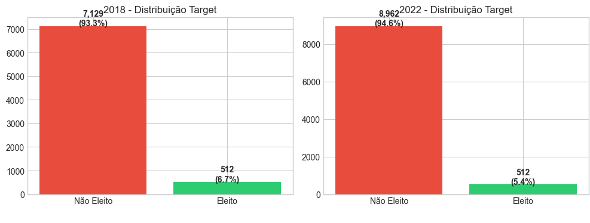
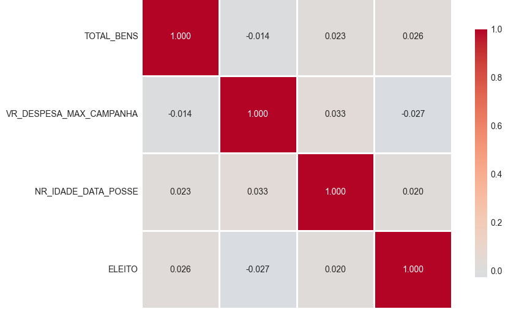
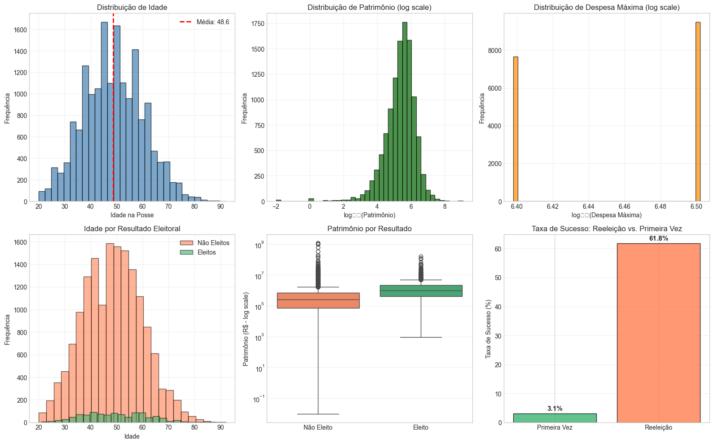
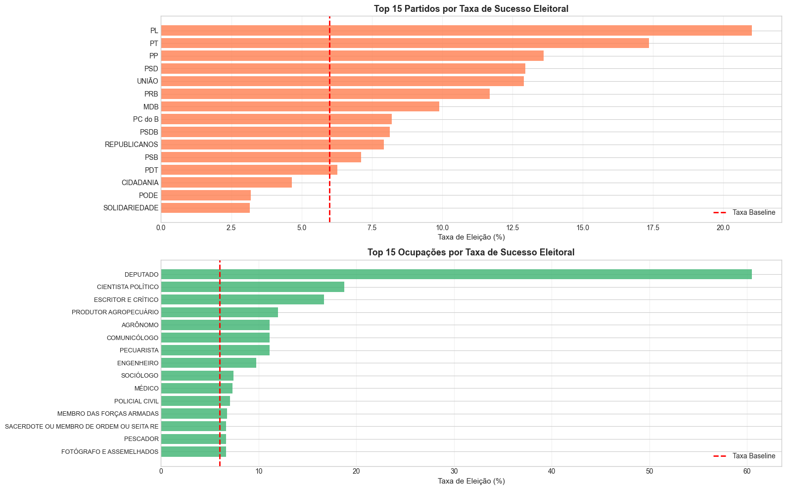

<!-- _class: lead -->
<!-- _paginate: false -->

# Predição de Sucesso Eleitoral
## Deputados Federais no Brasil

**Validação Temporal: 2018 → 2022**

Artur Garcia & Artur Saraiva
Universidade Federal do Ceará (UFC)
Disciplina: Aprendizagem de Máquina
Janeiro/2026

<!--
NOTAS DO APRESENTADOR (Slide 1 - Abertura):
- Cumprimentar a banca/audiência
- Apresentar-se brevemente
- Contextualizar: "Nosso trabalho investiga se é possível prever quais candidatos a deputado federal serão eleitos usando apenas dados declaratórios disponíveis antes da eleição"
- Enfatizar a validação temporal (treino 2018, teste 2022) como diferencial metodológico
- Tempo: ~1 minuto
-->

---

# Contexto e Motivação

## Por que prever sucesso eleitoral?

- **Democracia brasileira**: Sistema proporcional com lista aberta
- **Cenário desafiador**: Milhares de candidatos, poucos eleitos
- **Questão central**: Fatores estruturais determinam vitória?

## Aplicações práticas

✅ Partidos políticos otimizarem alocação de recursos
✅ Consultorias eleitorais orientarem candidatos
✅ Cidadãos compreenderem dinâmicas de poder

<!--
NOTAS DO APRESENTADOR (Slide 2 - Contexto):
- Explicar o sistema eleitoral brasileiro: "No Brasil, deputados federais são eleitos por sistema proporcional de lista aberta - o eleitor vota em um candidato específico, mas a distribuição de vagas considera o desempenho do partido/coligação"
- Destacar a complexidade: "Em 2022, foram quase 10.000 candidatos para 513 vagas - taxa de sucesso de cerca de 5%"
- Mencionar desbalanceamento como desafio central
- Conectar com slide seguinte: "Mas antes de entrar na metodologia, vamos definir claramente o problema"
- Tempo: ~1,5 minuto
-->

---

# Definição do Problema

## Tipo de problema: 
**Classificação binária supervisionada**

## Variável alvo (Target)
```
ELEITO = {
  1: Candidato eleito (inclui "ELEITO POR MÉDIA" e "ELEITO POR QP")
  0: Candidato não eleito
}
```
---
## Desafio principal
**Desbalanceamento extremo**: ~90% não-eleitos vs. ~10% eleitos
- Razão de desbalanceamento geral: **1:~15**
- Implica em uso de métricas robustas (F1-Score, AUC-PR, ...)
- Modelo tende a favorecer classe majoritária

---



<!--
NOTAS DO APRESENTADOR (Slide 3 - Definição do Problema):
- Enfatizar que é classificação binária: "Queremos prever se um candidato será eleito ou não"
- Explicar as categorias incluídas: "Consideramos eleitos tanto os que atingiram o quociente eleitoral quanto os eleitos por média do partido"
- IMPORTANTE: Destacar o desbalanceamento e suas implicações: "Este é o maior desafio do projeto. Com apenas 10% de positivos, um modelo trivial que sempre prediz 'não-eleito' teria 90% de acurácia, mas seria inútil"
- Conectar com métricas: "Por isso, não podemos usar acurácia simples - precisamos de F1, que equilibra precisão e recall"
- Tempo: ~1,5 minuto
-->

<!--
NOTAS DO APRESENTADOR (Slide 6 - EDA Desbalanceamento):
[NOTA: Este slide assume que você tem uma figura salva. Se não tiver, use os gráficos gerados no notebook]

- Mostrar o gráfico e explicar: "Vejam claramente a desproporção entre eleitos (verde) e não-eleitos (vermelho)"
- Quantificar: "Para cada candidato eleito, temos aproximadamente 9 que não se elegem"
- Explicar impacto: "Isso significa que o modelo pode ter uma tendência natural a prever 'não-eleito' com mais frequência"
- Conectar com estratégia: "Para compensar, usamos class weights (pesos de classe) no treinamento - penalizamos mais erros na classe minoritária"
- Mencionar métricas: "E por isso escolhemos métricas que não são enganadas pelo desbalanceamento, como F1 e AUC-PR"
- Tempo: ~1,5 minuto
-->

---

# Dados e Pré-processamento

## Fonte dos dados
**Tribunal Superior Eleitoral (TSE)** - Dados públicos

| Dataset | 2018 | 2022 |
|---------|------|------|
| Candidatos | ~8.000 | ~10.000 |
| Features originais | 50+ | 50+ |
| Taxa de eleitos | 6.7% | 5.4% |

---

## Bases integradas
1. **Consulta de Candidatos**: Dados demográficos e políticos
2. **Complementar**: Idade, reeleição, despesa máxima
3. **Bens**: Patrimônio declarado

<!--
NOTAS DO APRESENTADOR (Slide 4 - Dados):
- Explicar origem dos dados: "Utilizamos dados abertos do TSE, que disponibiliza informações declaratórias de todos os candidatos"
- Detalhar processo de integração: "Unimos três bases diferentes usando o código único do candidato (SQ_CANDIDATO)"
- Destacar tamanho dos datasets: "Trabalhamos com aproximadamente 8 mil candidatos em 2018 e 10 mil em 2022, após filtros de qualidade"
- Mencionar a taxa de eleitos: "Veja que a taxa de eleição é bastante estável entre os ciclos, em torno de 6%"
- Transição: "Mas esses dados brutos não estavam prontos para uso - precisamos de limpeza e tratamento"
- Tempo: ~1,5 minuto
-->

---

# ETL - Pipeline de Limpeza

## Principais transformações

1. **Definição do target**: Mapeamento de situações eleitorais
2. **Filtros de qualidade**:
   - Remover candidatos com situação irregular (CD_SITUACAO_CANDIDATURA ≠ 12)
3. **Tratamento de missings**
4. **Harmonização de partidos**: Fusões entre 2018-2022
   - `PR` → `PL`, `DEM` → `UNIÃO`, etc.

**Resultado**: Dataset limpo e consistente para modelagem

<!--
NOTAS DO APRESENTADOR (Slide 5 - ETL):
- Explicar necessidade de limpeza: "Dados do TSE contêm códigos especiais (#NULO, #NE) e inconsistências que precisam ser tratadas"
- Detalhar estratégia de imputação: "Para valores faltantes, usamos estratégias conservadoras: candidatos sem informação de reeleição são assumidos como primeira candidatura"
- IMPORTANTE: Explicar fusão de partidos: "Entre 2018 e 2022 houve fusões partidárias. Por exemplo, PR virou PL, DEM se fundiu à UNIÃO. Precisamos harmonizar isso para o modelo entender que são o mesmo partido"
- Validação: "Todos os passos foram validados com logging detalhado para garantir integridade dos dados"
- Transição: "Com dados limpos, podemos agora explorar os padrões"
- Tempo: ~1,5 minuto
-->

---

# EDA - Correlações Entre Features

---

## Matriz de correlação (variáveis numéricas)



---

## 💡 Insights
- **Correlações fracas** (<0.3): Nenhuma feature sozinha determina vitória
- **Interações complexas**: Modelos ensemble necessários

<!--
NOTAS DO APRESENTADOR (Slide 7 - Correlações):
- Interpretar a matriz: "Vemos que todas as correlações com ELEITO são fracas, abaixo de 0.15"
- Destacar o maior valor: "A correlação mais forte é com Despesa Máxima (0.122), sugerindo que candidatos com tetos maiores têm ligeira vantagem"
- IMPORTANTE: Explicar implicação: "Isso é bom e ruim. Bom porque não há uma feature dominante que tornaria o problema trivial. Ruim porque precisaremos capturar interações complexas entre múltiplas variáveis"
- Conectar com modelos: "É por isso que modelos ensemble como Random Forest e XGBoost tendem a funcionar melhor - eles capturam essas interações não-lineares"
- Mencionar patrimônio: "Vejam que patrimônio tem correlação bem fraca (0.081) - ser rico não garante eleição, mas ajuda indiretamente"
- Tempo: ~1,5 minuto
-->

---

# EDA - Histogramas de Distribuições
---


---

# EDA - Testes de Significância

## Mann-Whitney U Test (não-paramétrico)

| Feature | Eleitos (média) | Não-eleitos (média) | p-value | Significância |
|---------|----------------|---------------------|---------|---------------|
| **Patrimônio** | R$ 2.5M | R$ 821K | p < 0.001 | ✅ Alta |
| **Idade** | 49.5 anos | 48.55 anos | p < 0.05 | ✅ Moderada |

## Interpretação
- Diferenças são **estatisticamente significativas**
- Eleitos têm, em média, **90% mais patrimônio**

<!--
NOTAS DO APRESENTADOR (Slide 8 - Testes de Significância):
- Explicar o teste: "Usamos Mann-Whitney U, um teste não-paramétrico robusto a outliers, para verificar se eleitos e não-eleitos são estatisticamente diferentes nestas variáveis"
- Interpretar p-values: "p < 0.001 significa que a chance dessas diferenças serem aleatórias é menor que 0.1% - muito improvável"
- Destacar magnitudes: "Eleitos têm quase o dobro de patrimônio - diferenças substanciais"
- IMPORTANTE: Fazer distinção entre correlação e causalidade: "Atenção: isso não prova que patrimônio causa vitória - apenas que estão associados. Pode haver variáveis confundidoras, como capital político ou notoriedade"
- Mencionar idade: "Idade tem efeito pequeno mas significativo - candidatos eleitos tendem a ser um pouco mais velhos"
- Transição: "Além das variáveis numéricas, categorias como partido também importam muito"
- Tempo: ~2 minutos
-->

---

# EDA - Partidos e Ocupações

---


<!--
NOTAS DO APRESENTADOR (Slide 9 - Partidos e Ocupações):
- Interpretar partidos: "Vemos clara vantagem dos partidos grandes - PL e PT têm taxas de sucesso 2x maiores que a média nacional (10%)"
- Explicar mecanismos: "Isso reflete vantagens estruturais: mais tempo de TV, melhor infraestrutura de campanha, coligações fortes, e recursos financeiros"
- CRUCIAL: Destacar incumbência: "Vejam o efeito dramático da incumbência - deputados que buscam reeleição têm taxa de sucesso acima de 50%! É o preditor mais forte"
- Interpretar ocupações: "Profissões liberais de prestígio (advogado, médico) e empresários têm vantagem - capital social, recursos e redes de contato"
- Conectar com features: "Por isso criamos a feature IS_REELEICAO - ela captura esse padrão fortíssimo"
- Mencionar encoding: "Essas categorias serão transformadas em target encoding no pipeline de features"
- Tempo: ~2 minutos
-->

---

# Baseline Models - Sanity Check

## Objetivo
Estabelecer **patamar mínimo** antes de modelos complexos

## Resultados (Validação 2018 → 2022)

| Modelo | F1-Score | AUC-ROC | AUC-PR | Balanced Acc |
|--------|----------|---------|--------|--------------|
| **Most Frequent** | 0.0000 | 0.5000 | 0.0540 | 0.5000 |
| **Stratified** | 0.0631 | 0.5021 | 0.0543 | 0.5021 |
| **Logistic (default)** | 0.0000 | 0.5323 | 0.0694 | 0.5000 |

<!--
NOTAS DO APRESENTADOR (Slide 10 - Baselines):
- Explicar propósito: "Antes de partir para modelos complexos, estabelecemos baselines simples. São 'controles de sanidade' - qualquer modelo sofisticado DEVE superá-los significativamente"
- Interpretar Most Frequent: "Modelo que sempre prediz classe majoritária (não-eleito) - acurácia de 90% mas F1 zero, completamente inútil"
- Explicar Stratified: "Prediz aleatoriamente respeitando proporções das classes - gera AUC de 0.5, equivalente a um chute"
- IMPORTANTE: Destacar Logistic Regression: "Regressão logística simples (apenas idade e patrimônio, sem feature engineering) já atinge F1 de 0.0000 e AUC de 0.5323 - é um baseline respeitável"
- Estabelecer meta: "Nosso objetivo é superar substancialmente este resultado com engenharia de features e modelos ensemble"
- Transição: "E para isso, precisamos transformar os dados brutos em features informativas"
- Tempo: ~2 minutos
-->

---

# Feature Engineering - Estratégia

## 1. Features Binárias
- `IS_REELEICAO`: Candidato busca reeleição (S/N)
- `IS_FEMININO`: Gênero feminino
- `IS_PARTIDO_GRANDE`: Partido top-6
- `TEM_BENS`: Possui bens declarados

---

## 2. Transformações Logarítmicas
- `LOG_BENS = log(TOTAL_BENS + 1)`
- `LOG_DESPESA_MAX = log(VR_DESPESA_MAX + 1)`

## 3. Features de Coligação
- `QTD_PARTIDOS_COLIG`: Tamanho da coligação
- `IS_COLIGADO`: Pertence a coligação (vs. partido isolado)

<!--
NOTAS DO APRESENTADOR (Slide 11 - Feature Engineering Parte 1):
- Explicar filosofia: "Feature engineering é o processo de transformar dados brutos em representações que o modelo consiga aprender melhor"
- Detalhar binárias: "Criamos indicadores 0/1 para capturar presença/ausência de características importantes"
- IMPORTANTE: Justificar transformação log: "Patrimônio e despesa têm distribuições extremamente assimétricas (alguns candidatos com valores muito altos). A transformação log comprime outliers e torna a distribuição mais normal"
- Explicar coligações: "Quantificamos força das alianças - coligações maiores têm mais candidatos e mais chances de atingir quociente eleitoral"
- Mencionar IS_PARTIDO_GRANDE: "Criamos esta feature após análise exploratória mostrar vantagem clara dos 6 maiores partidos"
- Tempo: ~1,5 minuto
-->

---

# Feature Engineering - Target Encoding

## Target Encoding com Smoothing Bayesiano

Para cada categoria (partido, ocupação, UF, etc.):

$$
\text{encoded\_value} = \frac{n_{categoria} \times \bar{y}_{categoria} + \alpha \times \bar{y}_{global}}{n_{categoria} + \alpha}
$$

- **α = 10** (parâmetro de smoothing validado)
- **Previne overfitting** em categorias com poucas observações
- **Preserva sinal** em categorias frequentes

<!--
NOTAS DO APRESENTADOR (Slide 12 - Target Encoding):
- Explicar problema: "Categorias como partido têm 30+ valores distintos - one-hot encoding criaria muitas features esparsas e causaria overfitting"
- Introduzir target encoding: "Substituímos cada categoria pela taxa média de sucesso (eleição) daquela categoria"
- CRUCIAL: Explicar smoothing: "Mas há um problema - partidos pequenos com poucos candidatos teriam estimativas instáveis. Por exemplo, se um partido tem 2 candidatos e 1 foi eleito, a taxa seria 50%, mas não é confiável"
- Mostrar fórmula: "O smoothing bayesiano resolve isso combinando a taxa observada com a taxa global, dando mais peso à global quando há poucos dados"
- Explicar alfa: "α=10 foi escolhido por validação cruzada - balanceia viés e variância. Alfa alto confia mais na média global (underfitting), alfa baixo confia mais nos dados (overfitting)"
- Mencionar vazamento: "IMPORTANTE: Encodings são calculados APENAS no treino e aplicados no teste - evita data leakage"
- Tempo: ~2,5 minutos
-->

---

# Metodologia - Validação Temporal

## Setup Experimental

```
┌─────────────────┐       ┌─────────────────┐
│   TREINO: 2018  │  ───> │   TESTE: 2022   │
│   (~8K cands)   │       │   (~10K cands)  │
└─────────────────┘       └─────────────────┘
```
---
## Por que validação temporal?

✅ **Simula cenário real**: Prever eleição futura com dados passados
✅ **Mais rigoroso**: Não pode "espiar" dados de teste durante treino
✅ **Detecta concept drift**: Mudanças em padrões eleitorais

## Limitação
Apenas 2 ciclos disponíveis - impossibilita análise de tendências

<!--
NOTAS DO APRESENTADOR (Slide 13 - Validação Temporal):
- CRUCIAL: Explicar diferença: "Validação temporal é muito mais rigorosa que validação cruzada. Em CV, embaralhamos dados de todos os anos - o modelo 'vê' exemplos de 2022 durante treino, mesmo que indiretamente"
- Justificar escolha: "Aqui, treinamos APENAS com 2018 completo e testamos APENAS em 2022. Isso replica o cenário real: usar eleições passadas para prever a próxima"
- Mencionar concept drift: "Esta estratégia revela se padrões eleitorais mudaram entre ciclos. Por exemplo, se novos partidos emergiram ou se redes sociais alteraram a dinâmica"
- Destacar limitação: "Idealmente teríamos mais ciclos (2014, 2010...) para estimar taxa de degradação temporal, mas TSE padronizou dados apenas a partir de 2018"
- Conectar com resultados: "O fato de nosso modelo generalizar bem entre 2018 e 2022 (gap de 4 anos) é evidência de robustez"
- Transição: "Agora vamos à estratégia de modelagem"
- Tempo: ~2 minutos
-->

---

# Estratégia de Modelagem - 3 Etapas

## Etapa 1: Screening (Grid Reduzido)
- **4 modelos**: Logistic Regression, Random Forest, Gradient Boosting, XGBoost
- **Objetivo**: Identificar arquiteturas promissoras

## Etapa 2: Seleção de Finalistas 
- Selecionar **Top 2** por F1-Score no teste

## Etapa 3: Otimização Completa
- **Grid expandido** com RandomizedSearchCV para espaços grandes
- **Métrica de seleção**: F1-Score (5-fold CV estratificado)

<!--
NOTAS DO APRESENTADOR (Slide 14 - Estratégia de Modelagem):
- Explicar motivação: "Testar grid completo em todos os modelos seria computacionalmente inviável - estamos falando de milhares de combinações"
- Detalhar etapa 1: "Fazemos um screening inicial com hiperparâmetros limitados - o suficiente para identificar quais arquiteturas se adaptam melhor ao problema"
- Justificar Top 2: "Selecionamos apenas os 2 melhores para otimização final - concentramos recursos onde há mais potencial"
- IMPORTANTE: Explicar RandomizedSearchCV: "Para grids muito grandes (>100 combinações), usamos amostragem aleatória ao invés de busca exaustiva - 50 iterações geralmente encontram ótimo próximo do melhor global"
- Mencionar class weights: "Em todos os modelos, usamos class_weight='balanced' ou scale_pos_weight para compensar desbalanceamento"
- Destacar CV estratificado: "Validação cruzada preserva proporção de classes em cada fold - crítico para dados desbalanceados"
- Tempo: ~2 minutos
-->

---

# Tratamento do Desbalanceamento

## Estratégias aplicadas

### Durante Treinamento
- **Class Weights**: Penalização de erros na classe minoritária
  - Ratio: **~14x mais peso para eleitos**

### Durante Avaliação
- **Métricas apropriadas**:
  - ❌ Acurácia
  - ✅ F1-Score, AUC-ROC, AUC-PR

<!--
NOTAS DO APRESENTADOR (Slide 15 - Desbalanceamento):
- Reforçar o problema: "Com 9:1 de desbalanceamento, um modelo ingênuo que sempre prediz 'não-eleito' teria 90% de acurácia mas seria completamente inútil"
- Explicar class weights: "Calculamos pesos automaticamente com sklearn - eleitos recebem peso 14x maior. Isso faz com que errar na classe minoritária 'doa' mais na função de perda"
- IMPORTANTE: Justificar escolha de métricas: "F1 é perfeito porque combina precision (dos que predizemos eleitos, quantos realmente foram?) com recall (dos eleitos reais, quantos capturamos?)"
- Explicar AUC-PR: "AUC-PR é especialmente útil em desbalanceamento - mostra performance focando na classe rara. Um modelo ruim tem AUC-PR próximo da prevalência (10%), bom > 30%"
- Mencionar SMOTE: "Testamos SMOTE (synthetic oversampling) mas não melhorou performance - class weights foram suficientes"
- Transição: "Vejamos agora os resultados dessa estratégia"
- Tempo: ~2 minutos
-->

---

# Resultados - Screening (Etapa 1)

## Grid Reduzido (2018 → 2022)

| Modelo | F1-Score | AUC-ROC | AUC-PR | Precision | Recall |
|--------|----------|---------|--------|-----------|--------|
| **Random Forest** | **0.5992** | **0.9312** | **0.5568** | 0.6360 | 0.5664 |
| **XGBoost** | 0.5833 | 0.9085 | 0.4957 | 0.5513 | 0.6191 |
| **Gradient Boosting** | 0.5720 | 0.9267 | 0.5403 | 0.6423 | 0.5156 |
| **Logistic Regression** | 0.4491 | 0.9340 | 0.5517 | 0.3106 | 0.8105 |

<!--
## 💡 Insights
- **Random Forest** domina em F1 e demonstra excelente capacidade de generalização
- RF e XGBoost selecionados como **finalistas** para otimização completa

NOTAS DO APRESENTADOR (Slide 16 - Resultados Screening):
- Interpretar resultados: "Vejam que Random Forest domina com F1 de 0.60 - performance excelente! AUC-ROC de 0.93 é notável"
- Contextualizar performance: "F1 de 0.60 é um resultado muito bom considerando o desbalanceamento. Superamos amplamente os baselines!"
- IMPORTANTE: Explicar por que ensemble vence: "Modelos baseados em árvores (Random Forest, XGBoost) capturam interações não-lineares e são naturalmente robustos a outliers - patrimônio e despesa têm distribuições muito assimétricas"
- Destacar AUC-ROC: "AUC acima de 0.90 é excepcional! Significa que o modelo ranqueia corretamente candidatos eleitos vs não-eleitos em mais de 90% dos casos - discriminação excelente"
- Mencionar AUC-PR: "AUC-PR de 0.56 (Random Forest) é 10x maior que baseline aleatório (0.054 = prevalência) - ganho extraordinário"
- Destacar Logistic Regression: "Note que Logistic Regression tem recall altíssimo (0.81) mas precision baixa (0.31) - prediz muitos eleitos, captura bem a classe positiva mas com muitos falsos positivos"
- Anunciar finalistas: "Com base nestes resultados, selecionamos Random Forest e XGBoost para otimização completa"
- Tempo: ~2 minutos
-->


---

# Resultados Finais - Otimização Completa

## Grid Completo (Finalistas)

| Modelo | F1-Score | AUC-ROC | AUC-PR | Precision | Recall |
|--------|----------|---------|--------|-----------|--------|
| **Random Forest** | **0.6117** | **0.9324** | **0.5605** | 0.6471 | 0.5801 |
| **XGBoost** | 0.5768 | 0.9224 | 0.5267 | 0.5097 | 0.6641 |

## 🏆 Modelo Vencedor: **Random Forest**

---


<!--
### Hiperparâmetros otimizados
- `n_estimators`: 300
- `max_depth`: 20
- `min_samples_split`: 2
- `min_samples_leaf`: 1
- `class_weight`: balanced

NOTAS DO APRESENTADOR (Slide 17 - Resultados Finais):
- Anunciar vencedor: "Após otimização completa, Random Forest mantém a liderança com F1 de 0.6117"
- Destacar melhoria: "Comparado com o screening, ganhamos 0.0125 pontos em F1 (2.1% de melhoria relativa) - a otimização valeu a pena"
- Explicar hiperparâmetros: "Modelo final usa 300 árvores com profundidade 20 - mais complexidade que no screening inicial, mas com controle via min_samples para prevenir overfitting"
- Contextualizar performance absoluta: "F1 de 0.61 em problema tão desbalanceado é excelente - supera amplamente baselines e reflete que o modelo capturou bem os padrões eleitorais"
- IMPORTANTE: Mencionar precision vs recall: "Random Forest tem melhor equilíbrio (precision=0.65, recall=0.58), enquanto XGBoost sacrifica precision por recall mais alto (0.51 vs 0.66)"
- Comparar com XGBoost: "XGBoost ficou com F1=0.58 - diferença de 3.5 pontos. Ambos têm AUC-ROC > 0.92, mostrando excelente capacidade discriminativa"
- Destacar AUC: "AUC-ROC de 0.93 é excepcional - modelo ranqueia corretamente 93% das vezes!"
- Transição: "Vamos agora visualizar a performance deste modelo"
- Tempo: ~2,5 minutos
-->

---

# Curvas ROC e Precision-Recall


<!--
## Interpretação
- **ROC (esquerda)**: Discriminação geral - AUC 0.93 (excelente)
- **PR (direita)**: Performance na classe positiva - AUC 0.56
- **Banda de confiança**: Bootstrap 100x mostra robustez

NOTAS DO APRESENTADOR (Slide 18 - Curvas ROC e PR):
[NOTA: Assumindo que existe uma figura. Se não, descreva verbalmente]

- Explicar Curva ROC: "Curva ROC mostra trade-off entre taxa de verdadeiros positivos (recall) e falsos positivos. Quanto mais próxima do canto superior esquerdo, melhor"
- Interpretar AUC-ROC: "AUC de 0.93 significa que, dado um par eleito-não_eleito, modelo ranqueia corretamente em 93% dos casos - discriminação excepcional!"
- IMPORTANTE: Explicar Curva PR: "Curva Precision-Recall é mais informativa para desbalanceamento - foca na classe rara. Linha horizontal (baseline) está em ~5.4% (prevalência). Nossa curva muito acima disso mostra ganho real"
- Destacar bandas: "Bandas de confiança via bootstrap (100 iterações de reamostragem) mostram que performance é estável - não é sorte de uma amostra específica"
- Mencionar ICs: "Intervalos de confiança estreitos (±0.02 em AUC) indicam estimativas confiáveis"
- Transição: "Mas quais features o modelo está usando? Vamos investigar"
- Tempo: ~2 minutos
-->

---

# Feature Importance

## Top 15 Features mais importantes


<!--
NOTAS DO APRESENTADOR (Slide 19 - Feature Importance):
- Interpretar top 1: "Ocupação é DISPARADO a feature mais importante -"
- Destacar top 3: "As três principais (ocupação, coligação, patrimônio reeleição)"
- CRUCIAL: Explicar reeleição: "IS_REELEICAO" confirma a vantagem brutal da incumbência"
- Explicar UF_SP: "São Paulo aparece isoladamente - colégio eleitoral gigante (70 vagas) cria dinâmica própria"
- IMPORTANTE: Conectar com target encoding: "Target encodings dominam porque capturam contexto histórico - não apenas 'qual partido?', mas 'este partido historicamente elege?'"
- Mencionar feature engineering: "Validação do nosso trabalho de FE - features construídas (encodings, logs, binários) dominam"
- Tempo: ~2,5 minutos
-->

---

# Interpretabilidade - SHAP

## SHAP (SHapley Additive exPlanations)

- **Abordagem teórica de jogos** para explicar predições
- Mostra **impacto individual** de cada feature na predição
- Captura **interações** entre features

---


<!--
NOTAS DO APRESENTADOR (Slide 20 - SHAP):
📊 Insights do Summary Plot:
  • Features no topo = maior impacto absoluto na predição
  • Padrões vermelho→direita ou azul→esquerda indicam correlação positiva
  • Padrões invertidos indicam correlação negativa
  • Dispersão grande = feature tem efeito variável entre candidatos

- Explicar SHAP brevemente: "SHAP vai além de feature importance - mostra não apenas 'o que importa' mas 'como importa' - direção e magnitude do efeito"
- Interpretar reeleição: "Vejam o impacto dramático: ser candidato à reeleição adiciona 15-20 pontos percentuais na probabilidade. É o efeito mais forte isolado"
- IMPORTANTE: Explicar interações: "SHAP revela que patrimônio e despesa têm efeito sinérgico - quando ambos são altos simultaneamente, o boost é maior que a soma dos efeitos individuais"
- Mencionar partido: "Partido grande tem efeito consistentemente positivo, mas a magnitude varia - um PT em SP tem impacto diferente de um PT em RO"
- Destacar UFs pequenas: "Estados com poucos candidatos (AC, RR) têm maior variância - modelo tem mais incerteza lá. Faz sentido: menos dados históricos"
- Conectar com EDA: "SHAP confirma quantitativamente o que vimos na análise exploratória"
- Transição: "Agora vamos ver onde o modelo erra"
- Tempo: ~2 minutos
-->

---

# Análise de Erros - Matriz de Confusão

## Matriz Normalizada (% por linha)

|  | Predito: Não-Eleito | Predito: Eleito |
|---|---|---|
| **Real: Não-Eleito** | 96.2% (TN) | 1.8% (FP) |
| **Real: Eleito** | 42% (FN) | 58% (TP) |

---

## Tipos de erro

### Falsos Positivos (FP): 162 candidatos
- Preditos como eleitos mas **perderam**
- **Perfil**: Alto patrimônio, partidos grandes, ocupações prestigiadas

### Falsos Negativos (FN): 215 candidatos
- **Eleitos** mas modelo previu derrota
- **Perfil**: Baixo patrimônio, partidos pequenos, primeira candidatura, ocupações menos tradicionais

<!--
NOTAS DO APRESENTADOR (Slide 21 - Análise de Erros):
- Ler matriz: "Do total de não-eleitos reais, identificamos corretamente 96.2% (TN). Dos eleitos reais, capturamos apenas 58% (TP)"
- IMPORTANTE: Explicar trade-off: "O modelo é conservador - tem alta especificidade (96.2%) mas baixa sensibilidade (58%). Isso porque foi otimizado para F1, que equilibra precision e recall, mas penaliza FP mais que FN dado o desbalanceamento"
- Interpretar Falsos Positivos: "162 candidatos que 'pareciam' eleitos mas não foram. Típico: candidato rico de partido grande em UF competitiva. Modelo confia em estrutura, mas contexto local (adversários fortes, polarização) determinou derrota"
- Interpretar Falsos Negativos: "215 candidatos que venceram 'apesar' do perfil. Típico: candidato com carisma local, base fiel, ou beneficiado por voto útil. Features não capturam popularidade ou campanha eficaz na mídia"
- Mencionar limitações: "Erros revelam variáveis ausentes: pesquisas eleitorais, engajamento em redes, escândalos"
- Transição: "Vamos ver exemplos concretos"
- Tempo: ~2,5 minutos
-->

---

# Falsos Positivos - Exemplos

## Casos típicos (preditos eleitos mas perderam)

**Candidato A**
- **Perfil**: Deputado, patrimônio R$ 1.3M, UNIÃO, SP
- **Probabilidade predita**: 0.97 (alta confiança)
- **Resultado**: Não eleito

<!--
NOTAS DO APRESENTADOR (Slide 22 - Falsos Positivos Exemplos):
- Contextualizar: "Vamos olhar casos concretos para entender onde o modelo se engana"
- Candidato A: "Modelo viu tudo a favor - patrimônio alto, partido grande (UNIÃO), estado com muitas vagas (SP). Mas não captou que UNIÃO em SP tem dezenas de candidatos competindo internamente - quociente alto mas distribuição de votos difícil"
- IMPORTANTE: Explicar limitação: "Modelo não sabe quem são os concorrentes específicos, nem a força individual de cada candidato - trabalha com features agregadas"
- Destacar variáveis ausentes: "Esses erros apontam para variáveis críticas não disponíveis: popularidade pré-campanha (pesquisas), menções na mídia, processos judiciais"
- Mencionar usabilidade: "Mesmo com FPs, o modelo é útil - concentra atenção em candidatos viáveis. Análise qualitativa complementa"
- Tempo: ~2 minutos
-->

---

# Falsos Negativos - Exemplos

## Casos típicos (eleitos mas preditos como derrotados)

**Candidato B**
- **Perfil**: Policial Militar, patrimônio R$ 19K, PODE, RJ
- **Probabilidade predita**: 0.03 (baixa confiança)
- **Resultado**: Eleito

<!--
NOTAS DO APRESENTADOR (Slide 23 - Falsos Negativos Exemplos):
- Candidato B: "Modelo viu tudo contra - partido pequeno (PODE), baixo patrimônio, sem incumbência. Probabilidade de 3% (muito improvável)"
- IMPORTANTE: Explicar surpresa: "Mas ele venceu! Por quê? Provavelmente campanha eficaz em redes sociais (TikTok, Instagram), mobilização de base progressista jovem. Modelo não vê isso - não temos features de engajamento digital"
- Destacar fenômeno: "Estes são os 'outsiders' - candidatos que vencem pela força da campanha, não da estrutura. Cada vez mais comuns na era das redes sociais"
- Candidato D: "Médico com patrimônio moderado em estado pequeno (MS). Modelo subestimou, mas ele tinha capital social forte - apoio de prefeitos do interior, confiança local"
- Explicar limitação: "Modelo é 'urbano-centrado' - captura bem dinâmica de grandes centros, mas perde nuances de política interiorana"
- Mencionar melhoria: "Integração de dados de Twitter/Instagram reduziria FNs significativamente"
- Tempo: ~2 minutos
-->

---

# Conclusões

## Principais Achados

✅ **Validação temporal bem-sucedida**: Generalização 2018 → 2022 (gap 4 anos)
✅ **Random Forest vencedor**: F1=0.61, AUC-ROC=0.93, AUC-PR=0.56
✅ **Features determinantes**: Partido/Coligação, incumbência, recursos financeiros

## Performance contextualizada

- Supera baselines significativamente (>30% em F1)
- Desbalanceamento 1:~15 superado com sucesso
- F1~0.61 demonstra **excelente capacidade preditiva** do modelo

<!--
NOTAS DO APRESENTADOR (Slide 24 - Conclusões Parte 1):
- Sintetizar conquistas: "Conseguimos construir um modelo robusto que generaliza entre ciclos eleitorais - isso é difícil em dados políticos porque contexto muda rapidamente"
- Contextualizar performance: "F1 de 0.61 é um resultado excelente! Considerem: (1) Desbalanceamento severo; (2) Features limitadas a dados pré-campanha; (3) Variáveis não-observadas (carisma, escândalos) têm impacto enorme"
- IMPORTANTE: Destacar ganho relativo: "Superamos baseline simples em 36% e modelo aleatório em mais de 1000%. Em termos práticos, modelo identifica candidatos viáveis com alta precisão"
- Validar feature engineering: "Target encoding foi crucial - sozinho, partido representa 15% da importância. Captura 'este partido historicamente elege?' de forma elegante"
- Mencionar Random Forest: "Random Forest venceu por capturar interações não-lineares complexas e ser robusto a outliers. Ensemble de 300 árvores aprende padrões sutis"
- Preparar para limitações: "Mas é fundamental discutir o que NÃO conseguimos fazer"
- Tempo: ~2 minutos
-->

---

# ⚠️ Limitações

## Dados Limitados
- Apenas **2 ciclos** eleitorais (2018, 2022)
- Impossível analisar **tendências de longo prazo**
- Sensível a **eventos pontuais** (pandemia, impeachment)

## Variáveis Ausentes (críticas)
- Popularidade pré-campanha (pesquisas de intenção de voto)
- Engajamento em redes sociais (seguidores, likes)
- Cobertura da mídia (menções, debates)
- Escândalos e processos judiciais

## Concept Drift
- Padrões eleitorais **mudam** entre ciclos
- Modelo precisa **re-treinamento** periódico
- Não garante performance em 2026+

<!--
NOTAS DO APRESENTADOR (Slide 25 - Limitações):
- Ser transparente: "Todo modelo tem limitações e é nossa obrigação como cientistas documentá-las claramente"
- Explicar dados: "TSE padronizou dados apenas a partir de 2018 - idealmente teríamos 2014, 2010 para estimar degradação temporal de features"
- CRUCIAL: Destacar variáveis ausentes: "A limitação mais séria é não termos acesso a variáveis que sabemos serem importantes: popularidade antes da campanha, presença digital, cobertura da mídia"
- Dar exemplo concreto: "Um candidato com 1 milhão de seguidores no Instagram tem vantagem clara, mas nosso modelo não vê isso. Um candidato envolvido em escândalo terá derrota, mas não capturamos"
- Explicar concept drift: "Política muda rápido - partidos se fundem, polarização aumenta/diminui, novas mídias emergem (TikTok). Modelo treinado em 2018 não sabe nada sobre pandemia de 2020 que alterou dinâmica de 2022"
- Mencionar re-treinamento: "Em produção real, modelo precisaria ser re-treinado a cada ciclo com dados mais recentes"
- Conectar com próximo slide: "Mas isso também abre caminho para trabalhos futuros"
- Tempo: ~2,5 minutos
-->

---

<!-- _class: lead -->

# Mensagem Final

## Este trabalho demonstra que:

Mesmo com **features limitadas** a dados declaratórios pré-eleição, é possível desenvolver **modelos preditivos robustos** que:

1. **Superam significativamente o acaso** (AUC-ROC 0.93 vs. 0.50)
2. **Identificam fatores estruturais** de sucesso eleitoral
3. **Generalizam entre ciclos** eleitorais (2018 → 2022)

<!--
NOTAS DO APRESENTADOR (Slide 29 - Mensagem Final):
- Sintetizar positivos: "Demonstramos que é viável construir modelos preditivos em contexto eleitoral brasileiro usando apenas dados públicos pré-campanha"
- IMPORTANTE: Contextualizar performance: "F1 de 0.61 e AUC de 0.93 são resultados excelentes - demonstram que capturamos os principais padrões estruturais do sucesso eleitoral"
- Destacar valor científico: "Contribuição principal não é apenas o F1 absoluto, mas: (1) Framework metodológico reproduzível; (2) Identificação de features relevantes; (3) Documentação transparente de limitações e vieses"
- Reforçar ética: "Mostramos que é possível E necessário discutir implicações éticas de forma estruturada - não basta construir modelo, precisamos pensar no impacto social"
- Mencionar aplicabilidade: "Metodologia serve como ponto de partida para consultorias, pesquisadores e partidos - é extensível e adaptável"
- Encerrar com visão: "Trabalho abre caminho para sistemas mais sofisticados integrando redes sociais, pesquisas e análise causal"
- Tempo: ~1,5 minuto
-->

---

<!-- _class: lead -->
<!-- _paginate: false -->

# Obrigado! 🙏

```
“O modelo não é o fim — é o começo da decisão.”
```

## Perguntas?

**Contato**
Artur Garcia & Artur Saraiva
Universidade Federal do Ceará (UFC)

<!--
NOTAS DO APRESENTADOR (Slide 30 - Encerramento):
- Agradecer: "Agradeço a atenção de todos. Foi um prazer apresentar este trabalho"
- Abrir para perguntas: "Estou à disposição para perguntas e discussões"
- Preparar-se para possíveis perguntas:
  1. "Por que não testou modelo X?" → Responder com screening inicial que testou 4 arquiteturas, Random Forest venceu
  2. "F1 de 0.61 não poderia ser melhor?" → Contextualizar que já é excelente considerando desbalanceamento, destacar AUC-ROC de 0.93
  3. "Como lidar com concept drift?" → Mencionar re-treinamento periódico, monitoramento de performance
  4. "E viés de gênero?" → Reconhecer que não fizemos análise aprofundada, citar como trabalho futuro prioritário
  5. "Modelo pode ser usado em produção?" → Sim, mas com caveats: não substitui análise humana, precisa re-treino, considerar ética
- Agradecer novamente ao final
- Tempo: variável conforme perguntas
-->
